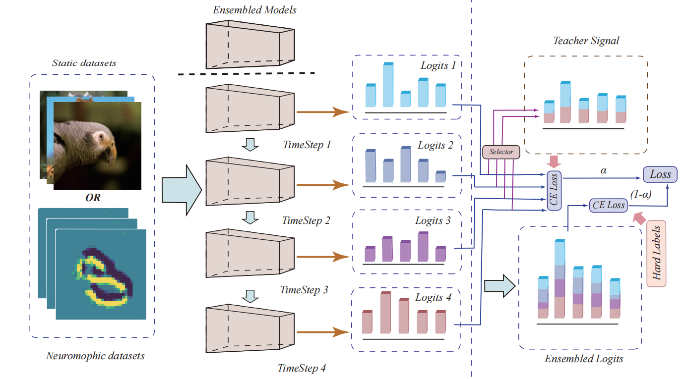

# Temporal Knowledge Sharing enable Spiking Neural Network Learning from Past and Future
This repository contains code from our paper [Temporal Knowledge Sharing enable Spiking Neural Network Learning from Past and Future](https://arxiv.org/abs/2304.06540).



## Requirments

braincog

numpy

scipy

pytorch >= 1.7.0

torchvision

torchmetrics==0.10.3

timm==0.6.13

tenserboard

tonic

## Run
TKS is based on Brain-Cog. To Run this code, download [braincog](https://github.com/BrainCog-X/Brain-Cog)

### train
```python train_main.py --model metarightsltet --learner VGG_SNN -b 128 --epochs 600 --device 0 --dataset cifar10 --num-classes 101 --T 3 --step 4 --alpha 0.7 --layer-by-layer```

### eval
```python train_main.py --model metarightsltet --learner VGG_SNN -b 128 --epochs 600 --device 0 --dataset cifar10 --num-classes 101 --T 3 --step 4 --alpha 0.7 --layer-by-layer --eval --eval [your checkpoint path]```
 
## Citation
If you use this code in your work, please cite the following paper, please cite it using
```
  @article{dong2023temporal,
    title={Temporal Knowledge Sharing enable Spiking Neural Network Learning from Past and Future},
    author={Dong, Yiting and Zhao, Dongcheng and Zeng, Yi},
    journal={arXiv preprint arXiv:2304.06540},
    year={2023}
  }
```
